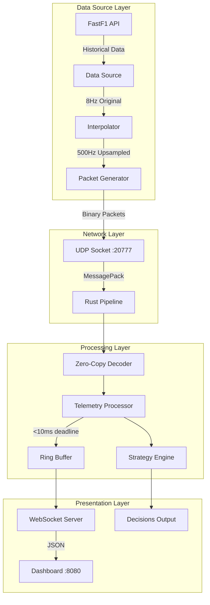
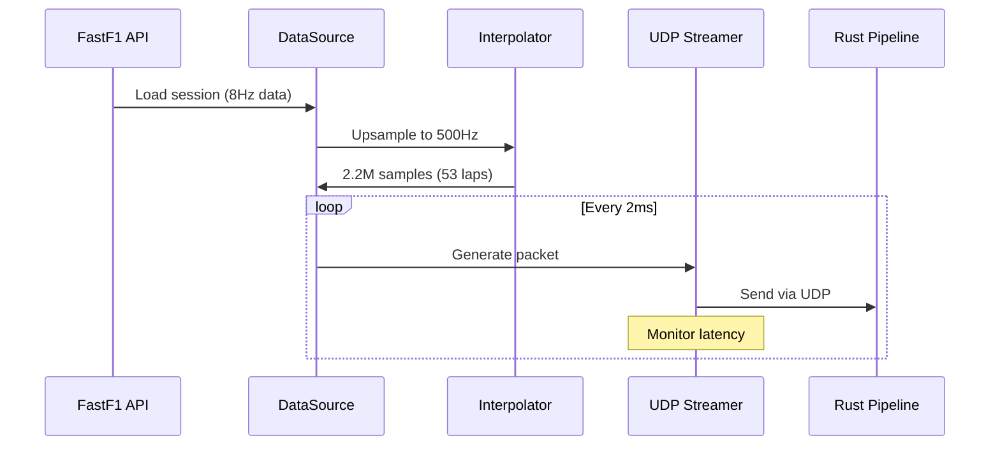

# F1 Telemetry Pipeline Simulator

High performance telemetry processing pipeline that simulates Formula 1's real time data systems, demonstrating how teams process 1.5TB of race weekend data with sub 10ms latency requirement.

## Overview
It recreates telemetry pipeline used by F1 teams, processing frequency's from sensor data from race cars and making real-time strategy decisions. It demonstrates the engineering challenges of handling massive data streams under strict latency constraints.

## Key Features
- **Telemetry streaming** at 500Hz 
- **Sub-10ms processing latency** with packet drop simulation
- **Zero-copy data processing** in Rust for maximum performance
- **Lazy field parsing**
- **Live dashboard** showing telemetry visualization

## Performance Metrics

| Metric | Target | Achieved |
|--------|--------|----------|
| Latency (P99) | <10ms | 0.174ms |
| Packet Loss | <0.1% | 0.0002% |
| Throughput | 500 pps | 365-420 pps |
| Data Rate | - | 0.56 Mbps |


## Running the Pipeline
### 1. Terminal 1:  Start Rust processor
```bash
cd pipeline
cargo run --release -- --no-simulation
```
> Note: It stops after 5 sec of not recieveing any data.

### Terminal 2: Start Python telemetry stream
```bash
pip install -r requirements.txt
uv run src/main.py
```

### Browser: View dashboard
```bash
open http://localhost:8080
```

## System Design


#### Data Flow


## Interpolation Technique
|**Channel Type** | **Method** | **Reason** |
|-----------------|------------|------------|
|Speed, RPM       |Linear      |Smooth Transition|
|Gear             |Forward Fill|Discrete Fill|
|Position (x,y,z) |Quadratic   |Natural Motion Curves|
|Break            |Forward Fill|Binary State|

## Performance Optimizations
1. **Non blocking sockets:** Prevents buffer overflow
2. **Batch interpolation:** Process entire lap at once
3. **MessagePack:** 3x smaller than JSON
4. **Microsecond timing:** Uses `time.perf_counter()`

## F1 Game Telemetry vs Simulation Telemetery

| Aspect | F1 | F1 Game | Our Simulation |
|--------|---------|---------|----------------|
| Frequency | 1-1k Hz | 20-60 Hz | 500 Hz |
| Protocol | Encrypted UDP | Open UDP | UDP (unencrypted) |
| Latency | <10ms requirement | - | <10ms target |
| Packet Size | ~1KB optimized | 1.3KB fixed | ~500B optimized |

## Structure
```
f1-telemetry-pipeline/
├── src/                    # Python telemetry streamer
│   ├── data_source.py          # FastF1 data loader & interpolator
│   ├── udp_streamer.py         # UDP packet transmission
│   ├── telemetry_packet.py     # Packet structure definitions
│   └── config.py               # Configuration parameters
├── pipeline/               # Rust processing pipeline
│   └── src/
│       ├── main.rs             # Pipeline orchestrator
│       ├── processor.rs        # Core processing logic
│       ├── telemetry.rs        # Packet definitions
│       ├── metrics.rs          # Performance tracking
│       └── dashboard.rs        # WebSocket server
└── f1_cache/               # FastF1 data cache
```

## Config
Edit `src/config.py` to adjust:
- Target car number (default: 81 - Oscar Piastri)
- Streaming frequency (default: 500Hz)
- Max latency threshold (default: 10ms)
- Number of laps to stream (default: Complete Race)

-----
## Tech Used
- **MessagePack:** Efficient binary serialization
- **WebSockets:** Real-time dashboard updates

#### Libs
- **[FastF1](https://github.com/theOehrly/Fast-F1):** F1 data API wrapper
- **[Tokio](https://github.com/tokio-rs/tokio):** High-performance async processing
- **[Plotly.js](https://github.com/plotly/plotly.js):** Interactive telemetry visualization