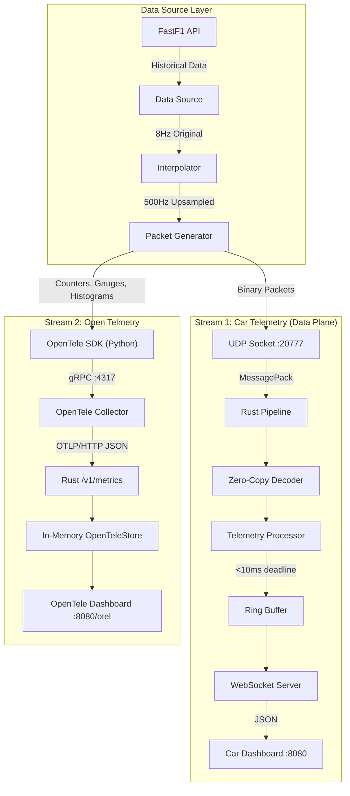
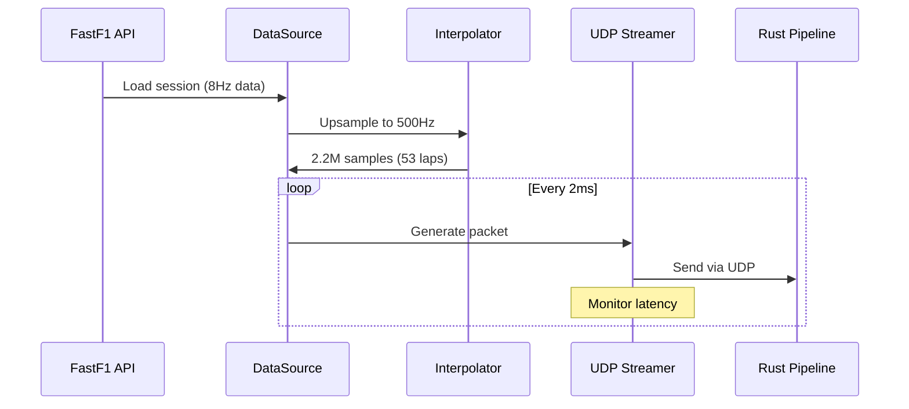

# F1 Telemetry Pipeline Simulator

A High performance telemetry processing pipeline that tries to mirror the real time data pipelines used by Formula 1 teams. Processes sensor data at 500Hz with <10ms latency  meeting the actual performance requirements of F1 pit wall systems.

## Overview
It recreates telemetry pipeline used by F1 teams, processing frequencies from sensor data from race cars and making real-time strategy decisions. It demonstrates the engineering challenges of handling massive data streams under strict latency constraints.


## Dual-Stream Architecture
The pipeline uses **two separate data streams** by design:

| Stream | Purpose | Protocol | Why |
|--------|---------|----------|-----|
| **Car Telemetry** (UDP) | Actual sensor data — speed, throttle, RPM, tyres | MsgPack over UDP | Raw performance: zero handshake, zero-copy decode, <10ms latency on every packet |
| **OTel Metrics** (OTLP) | Pipeline observability — throughput, latency, packet loss | OTLP via OTel Collector | Aggregated & batched: monitors pipeline health at 1-5s intervals without impacting the data plane |

**Why not send everything through OTel?** Car telemetry at 500Hz demands ms level processing per packet. OTel's batching, export intervals, and HTTP/gRPC overhead would add latency and risk drops under load. Conversely, the observability metrix don't need per-packet granularity, trends over seconds are enough.

> NOTE: The car telemetry uses MsgPack for minimal serialization overhead (~3x smaller than JSON), which is incompatible with Open Telemetery's Protobuf/JSON wire format.

## Key Features
1. **Data Upsampling:** F1's historical data (8Hz) interpolated to realistic sensor rates (500Hz) while preserving signal characteristics
2. **Zero-Copy Processing:** Eliminated deserialization overhead using custom MessagePack decoder
3. **Backpressure Handling:** Ring buffer with packet prioritization prevents system overload
4. **Jitter Minimization:** Microsecond-precision timing maintains consistent packet intervals

## Performance Metrics

| Metric | Target | Achieved |
|--------|--------|----------|
| Latency (P99) | <10ms | 0.174ms |
| Packet Loss | <0.1% | 0.0002% |
| Throughput | 500 pps | 365-420 pps |
| Data Rate | - | 0.56 Mbps |


## Running the Pipeline
### 1. Terminal 1:  Start Collector & Rust processor
```bash
docker compose up -d # to start open telemetery collector
cd pipeline
cargo run --release -- --no-simulation
```
> Note: The Rust backend now listens for OTLP metrics on `:8080/v1/metrics`.

### Terminal 2: Start Python telemetry stream
```bash
uv sync
uv run src/main.py
```

### Browser: View dashboard
```bash
open http://localhost:8080 # Car Telemetery: live speed, throttle, RPM charts via WebSocket
open http://localhost:8080/otel # Open Telemetery Matrix: pipeline observability (packets/sec, latency, loss rate)
```

### Verification
- **Dashboard**: Open `http://localhost:8080` to see real-time car telemetry via WebSockets.
- **OTel Dashboard**: Open `http://localhost:8080/otel` to see parsed OpenTelemetry metrics rendered by the Rust backend.
- **Observability**: Look for `[OTEL-SINK]` logs in Terminal 1. This confirms the Collector is successfully forwarding metrics to the Rust sink.
- **Collector Logs**: Run `docker logs -f otel-collector` to see the gRPC-to-HTTP translation in action.

### Open Telemetery Collector
On terminal-1:
```bash
# start the collector service
docker compose up -d

# watch the live metric stream
docker logs -f otel-collector
```

On terminal-2, start python sender:
```bash
uv run src/main.py
```

## Config
Edit `src/config.py` to adjust:
- Target car number (default: 81 - Oscar Piastri)
- Streaming frequency (default: 500Hz)
- Max latency threshold (default: 10ms)
- Number of laps to stream (default: Complete Race)

## System Design

```mermaid
graph TB
    subgraph "Data Source Layer"
        F1["FastF1 API"] -->|Historical Data| DS["Data Source"]
        DS -->|8Hz Original| INT["Interpolator"]
        INT -->|500Hz Upsampled| PG["Packet Generator"]
    end
    
    subgraph "Stream 1: Car Telemetry (Data Plane)"
        PG -->|Binary Packets| UDP["UDP Socket :20777"]
        UDP -->|MessagePack| RUST["Rust Pipeline"]
        RUST --> DEC["Zero-Copy Decoder"]
        DEC --> PROC["Telemetry Processor"]
        PROC -->|"<10ms deadline"| BUF["Ring Buffer"]
        BUF --> WS["WebSocket Server"]
        WS -->|JSON| DASH["Car Dashboard :8080"]
    end

    subgraph "Stream 2: Open Telmetry"
        PG -->|Counters, Gauges, Histograms| OTEL["OpenTele SDK (Python)"]
        OTEL -->|gRPC :4317| COLL["OpenTele Collector"]
        COLL -->|OTLP/HTTP JSON| SINK["Rust /v1/metrics"]
        SINK --> STORE["In-Memory OpenTeleStore"]
        STORE --> ODASH["OpenTele Dashboard :8080/otel"]
    end
```

#### Data Flow

```mermaid
sequenceDiagram
    participant FF as FastF1 API
    participant DS as DataSource
    participant INT as Interpolator
    participant UDP as UDP Streamer
    participant RUST as Rust Pipeline
    
    FF->>DS: Load session (8Hz data)
    DS->>INT: Upsample to 500Hz
    INT->>DS: 2.2M samples (53 laps)
    loop Every 2ms
        DS->>UDP: Generate packet
        UDP->>RUST: Send via UDP
        Note over UDP: Monitor latency
    end
```

## Interpolation Technique
|**Channel Type** | **Method** | **Reason** |
|-----------------|------------|------------|
|Speed, RPM       |Linear      |Smooth Transition|
|Gear             |Forward Fill|Discrete Fill|
|Position (x,y,z) |Quadratic   |Natural Motion Curves|
|Brake            |Forward Fill|Binary State|

## Performance Optimizations
1. **Non blocking sockets:** Prevents buffer overflow
2. **Batch interpolation:** Process entire lap at once
3. **MessagePack:** 3x smaller than JSON
4. **Microsecond timing:** Uses `time.perf_counter()`

## F1 Game Telemetry vs Simulation Telemetery

| Aspect | F1 | F1 Game | Our Simulation |
|--------|---------|---------|----------------|
| Frequency | 1-1k Hz | 20-60 Hz | 500 Hz |
| Protocol | Encrypted UDP | Open UDP | UDP (unencrypted) |
| Latency | <10ms requirement | - | <10ms target |
| Packet Size | ~1KB optimized | 1.3KB fixed | ~500B optimized |

## Structure
```
f1-telemetry-pipeline/
├── src/                    # Python telemetry streamer
│   ├── data_source.py          # FastF1 data loader & interpolator
│   ├── udp_streamer.py         # UDP packet transmission
│   ├── oltp_opentele.py        # OpenTelemetry SDK instrumentation
│   ├── telemetry_packet.py     # Packet structure definitions
│   └── config.py               # Configuration parameters
├── pipeline/               # Rust processing pipeline
│   └── src/
│       ├── main.rs             # Pipeline orchestrator
│       ├── processor.rs        # Core processing logic
│       ├── telemetry.rs        # Packet definitions
│       ├── metrics.rs          # Performance tracking
│       ├── open_tele_sink.rs        # OTLP JSON parser & metrics store
│       └── dashboard.rs        # WebSocket server
├── opentele-collector-config.yaml  # Open Telemetry Collector pipeline config
├── docker-compose.yml              # Open Telemetry Collector service
└── f1_cache/                       # FastF1 data cache
```

## Why This Matters

During a race weekend, F1 teams process:
- **300+ sensors** per car generating data at up to 1kHz
- **1.5TB of telemetry data** per weekend
- **Real-time decisions** that can win or lose races

This pipeline demonstrates understanding of:
- Latency constraints
- Handling burst traffic during critical events (braking zones, DRS activation)
- Priority-based processing for safety-critical data

## Future Enhancements

- [ ] Multi-car telemetry processing (full grid simulation)
- [ ] Machine learning for predictive tire degradation
- [ ] Integration with weather data for strategy optimization
- [ ] Replay capability for post-race analysis
-----
## Tech Used
- **MessagePack:** Efficient binary serialization
- **WebSockets:** Real-time dashboard updates

#### Libs
- **[FastF1](https://github.com/theOehrly/Fast-F1):** F1 data API wrapper
- **[Tokio](https://github.com/tokio-rs/tokio):** High-performance async processing
- **[Plotly.js](https://github.com/plotly/plotly.js):** Interactive telemetry visualization